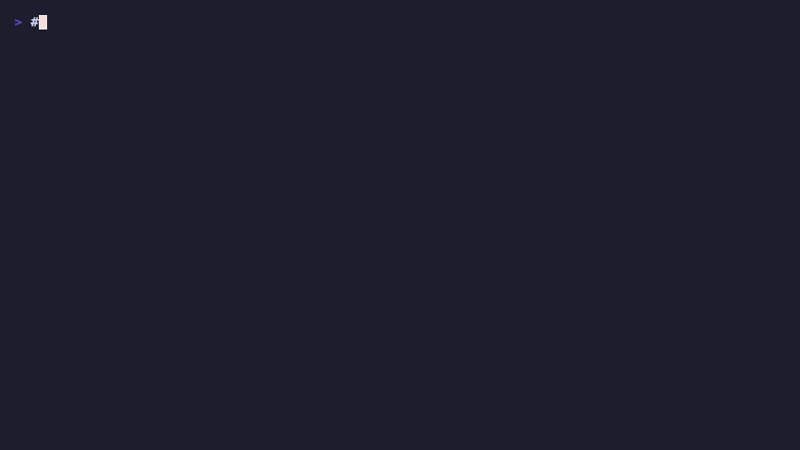
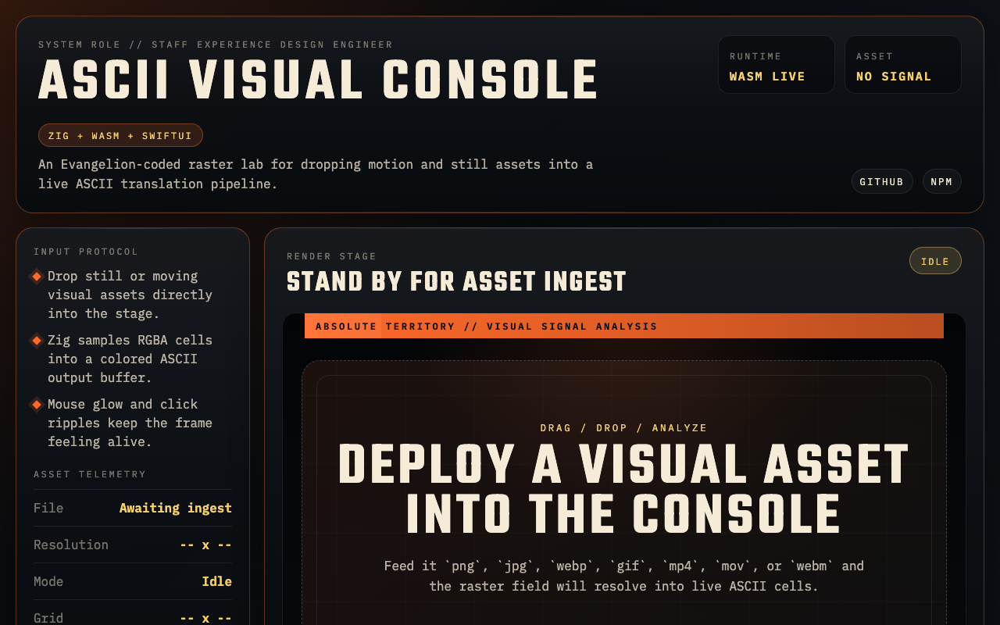
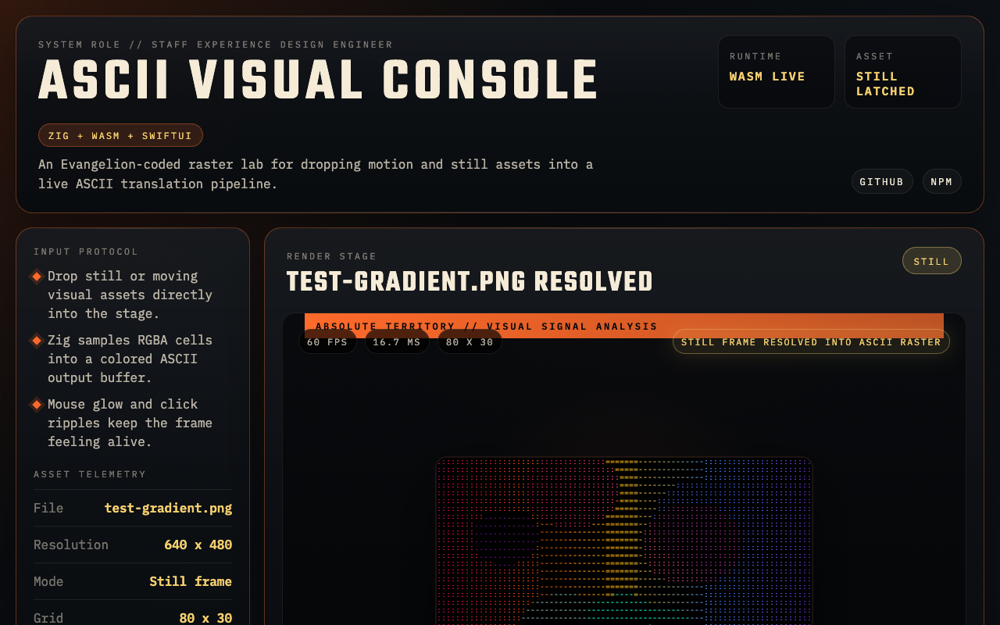

<p align="center">
  <pre align="center">
   ___  _ __  _____  _      _____  ___            ____ _____ ____ ___ ___
  / _ \| '_ \|_  / || |___ |_   _|/ _ \   ___   / ___|  ___|_ _|_ _|_ _|
 | |_) | | | |/ /| || / -_)  | | | (_) | |___| | (_| |___ || | | | | |
 | .__/|_|_\_/___|_||_\___|  |_|  \___/          \____|____||___|___|___|
 |_|
  </pre>
  <br>
  <b>Real-time video to ASCII art, powered by Zig + WebAssembly</b>
  <br><br>

  <a href="https://ziglang.org"></a>
  <a href="https://webassembly.org"></a>
  <a href="LICENSE"></a>
  <a href="https://github.com/nickcostanzo-work/pixel-to-ascii-zig/actions/workflows/ci.yml"></a>

</p>

## What is this?




`pixel-to-ascii` converts visual assets into ASCII art in real time. The core renderer is written in Zig, compiled to WebAssembly for the browser and to static libraries for native platforms (macOS, iOS). Drop an image or video file into the web app and watch it rendered as colored ASCII characters at 60+ FPS.

## Screenshots

<p align="center">
  
</p>

<p align="center">
  
</p>

## Features

- **60+ FPS** real-time conversion via Zig's zero-cost abstractions
- **8 character sets** from minimal (`. o O @`) to detailed (70 chars)
- **Interactive effects** — mouse glow, click ripples, audio reactivity
- **Drag & drop** still or motion assets into the console
- **Cross-platform** — Web (WASM), macOS (SwiftUI), iOS (SwiftUI), npm package
- **Perceptual brightness** using BT.601 luminance (0.299R + 0.587G + 0.114B)
- **Motion design system** — spring animations, reduced-motion support

## Quick Start

### Web (easiest)

```bash
# Build the WASM module
zig build wasm -Doptimize=ReleaseFast

# Serve the repo root so the browser can fetch the WASM file
python3 -m http.server 8000
```

Open `http://127.0.0.1:8000/web/index.html` and drag an image or video asset onto the stage.

### npm

```bash
npm install @zig-wasm/pixel-to-ascii
```

```js
import { initPixelToAsciiWasm } from '@zig-wasm/pixel-to-ascii';

const wasm = await initPixelToAsciiWasm();
wasm.init(1920, 1080, 80, 10);
wasm.updateVideoFrame(rgbaData, 1920, 1080, 1920 * 4);
const output = wasm.render(); // [charIdx, r, g, b] per cell
```

### SwiftUI

```swift
import PixelToAsciiUI

struct MyView: View {
    let engine = AsciiEngine()

    var body: some View {
        AsciiRendererView(engine: engine)
            .onAppear {
                engine.initialize(width: 1920, height: 1080, columns: 80)
            }
    }
}
```

Build the xcframework:

```bash
./scripts/build-xcframework.sh
```

Run the macOS console app:

```bash
cd swift/PixelToAsciiConsole
xcodebuild -project PixelToAsciiConsole.xcodeproj -scheme PixelToAsciiConsole -configuration Debug build
open ~/Library/Developer/Xcode/DerivedData/PixelToAsciiConsole-*/Build/Products/Debug/PixelToAsciiConsole.app
```

FlowDeck-ready project:

`swift/PixelToAsciiConsole/PixelToAsciiConsole.xcodeproj`

Scheme:

`PixelToAsciiConsole`

### Build from source

```bash
# All targets
zig build test                          # Run tests
zig build wasm -Doptimize=ReleaseFast   # WebAssembly
zig build macos -Doptimize=ReleaseFast  # macOS static lib
zig build ios -Doptimize=ReleaseFast    # iOS static lib
zig build lib                           # Native static lib
```

## How It Works

```
Video Frame (RGBA)
        |
        v
  +--------------+
  |  Grid Cell   |  Sample pixel at cell center
  |  Sampling    |  (col + 0.5) / cols * videoWidth
  +------+-------+
         v
  +--------------+
  |  Brightness  |  L = 0.299R + 0.587G + 0.114B
  |  Calculation |
  +------+-------+
         v
  +--------------+
  |   Effects    |  Mouse glow (5-cell radius falloff)
  |  Compositing |  Click ripples (expanding rings)
  +------+-------+  Audio modulation
         v
  +--------------+
  |  Character   |  brightness -> charset index
  |   Mapping    |  with audio reactivity
  +------+-------+
         v
  Output: [charIdx, R, G, B] per cell
```

The output buffer uses 4 bytes per grid cell: a character index into the active charset, plus the RGB color to render it with. This compact format lets JavaScript (Canvas 2D) and Swift (Canvas view) render efficiently without parsing strings.

## Character Sets

| Name | Characters | Best For |
|------|-----------|----------|
| `standard` | ` .:-=+*#%@` | General purpose |
| `blocks` | Block elements | Retro terminal look |
| `minimal` | ` .oO@` | Clean, simple output |
| `binary` | Space + block | High contrast |
| `detailed` | 70 characters | Maximum detail |
| `dots` | Dot variants | Dot matrix style |
| `arrows` | Arrow symbols | Directional flow |

## Configuration

| Option | Range | Default | Description |
|--------|-------|---------|-------------|
| `num_columns` | 20-200 | 80 | ASCII grid width |
| `brightness` | 0.2-3.0 | 1.0 | Brightness multiplier |
| `colored` | bool | true | Color vs monochrome |
| `blend` | 0.0-1.0 | 0.0 | Color blending factor |
| `highlight` | 0.0-1.0 | 0.0 | Bright area boost |
| `font_size` | float | 10.0 | Cell size for aspect ratio |

## Performance

| Resolution | Columns | Target FPS | Notes |
|-----------|---------|-----------|-------|
| 720p | 80 | 60+ | Smooth on all hardware |
| 1080p | 120 | 60+ | Optimal for most displays |
| 4K | 160 | 45+ | CPU-bound at high detail |

Memory usage: ~4 bytes per grid cell output + video frame buffer.

## Project Structure

```
src/
  main.zig              # WASM + C ABI exports
  renderer/device.zig   # Core ASCII renderer
  effects/mod.zig       # Mouse, ripple, audio effects
web/
  index.html            # Standalone web app (no build step)
  js/                   # WASM bridge, Canvas renderer, drag & drop
  css/                  # Dark theme + motion design system
swift/PixelToAscii/     # SwiftUI package scaffold
include/                # C header for native consumers
```

## Contributing

Contributions are welcome. Please follow [conventional commits](https://www.conventionalcommits.org/) for commit messages.

```bash
git checkout -b feat/my-feature
# make changes
zig build test
git commit -m "feat: add my feature"
```

## Documentation & Proof

See [docs/PROJECT_NARRATIVE.md](docs/PROJECT_NARRATIVE.md) for the full project narrative,
design methodology, and implementation proof.

## License

[MIT](LICENSE)

---

<p align="center">
  <sub>Made with Zig, rendered in ASCII</sub>
</p>
