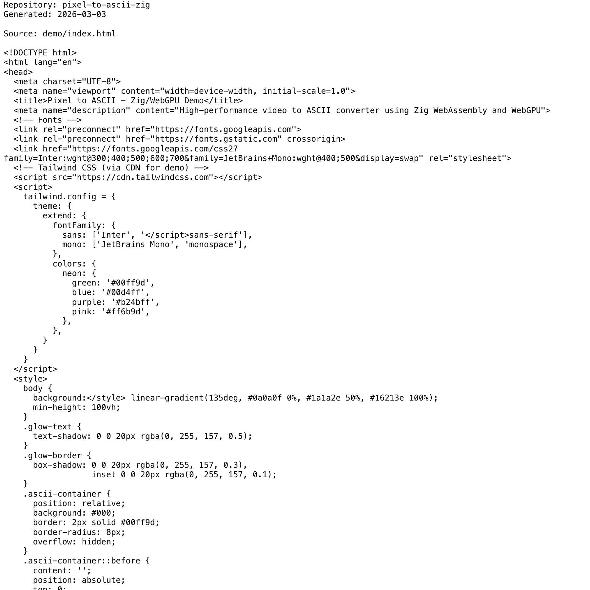

# Project Narrative & Proof

Generated: 2026-03-03

## User Journey
1. Discover the project value in the repository overview and launch instructions.
2. Run or open the build artifact for pixel-to-ascii-zig and interact with the primary experience.
3. Observe output/behavior through the documented flow and visual/code evidence below.
4. Reuse or extend the project by following the repository structure and stack notes.

## Design Methodology
- Iterative implementation with working increments preserved in Git history.
- Show-don't-tell documentation style: direct assets and source excerpts instead of abstract claims.
- Traceability from concept to implementation through concrete files and modules.

## Progress
- Latest commit: 4c4e6e1 (2026-03-03) - docs: add professional README with badges
- Total commits: 2
- Current status: repository has baseline narrative + proof documentation and CI doc validation.

## Tech Stack
- Detected stack: Node.js, TypeScript, GitHub Actions, HTML/CSS

## Main Key Concepts
- Key module area: `demo`
- Key module area: `src`
- Key module area: `src-js`

## What I'm Bringing to the Table
- End-to-end ownership: from concept framing to implementation and quality gates.
- Engineering rigor: repeatable workflows, versioned progress, and implementation-first evidence.
- Product clarity: user-centered framing with explicit journey and value articulation.

## Show Don't Tell: Screenshots


## Show Don't Tell: Code Excerpt
Source: `demo/index.html`

```html
<!DOCTYPE html>
<html lang="en">
<head>
  <meta charset="UTF-8">
  <meta name="viewport" content="width=device-width, initial-scale=1.0">
  <title>Pixel to ASCII - Zig/WebGPU Demo</title>
  <meta name="description" content="High-performance video to ASCII converter using Zig WebAssembly and WebGPU">
  <!-- Fonts -->
  <link rel="preconnect" href="https://fonts.googleapis.com">
  <link rel="preconnect" href="https://fonts.gstatic.com" crossorigin>
  <link href="https://fonts.googleapis.com/css2?family=Inter:wght@300;400;500;600;700&family=JetBrains+Mono:wght@400;500&display=swap" rel="stylesheet">
  <!-- Tailwind CSS (via CDN for demo) -->
  <script src="https://cdn.tailwindcss.com"></script>
  <script>
    tailwind.config = {
      theme: {
        extend: {
          fontFamily: {
            sans: ['Inter', '</script>sans-serif'],
            mono: ['JetBrains Mono', 'monospace'],
          },
          colors: {
            neon: {
              green: '#00ff9d',
              blue: '#00d4ff',
              purple: '#b24bff',
              pink: '#ff6b9d',
            },
          },
        }
      }
    }
  </script>
  <style>
    body {
```
